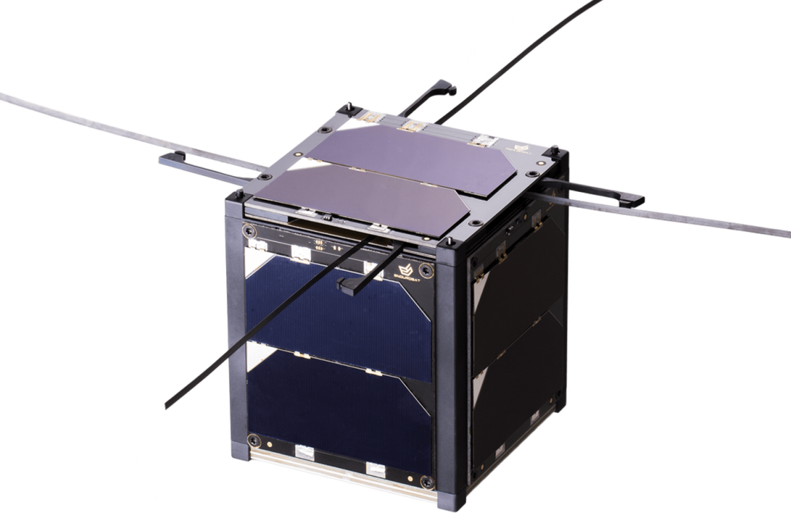

# LEO Cube Satellite Power Management System 

  

**AESS Sustainability Hackathon 2026 | Challenge 1: Sustainable Electronics**

##  The Mission: Albedo Weather Monitoring
Welcome to the future of energy-efficient space exploration. This repository houses the firmware, schematics, and technical documentation for a **CubeSat Albedo Weather Satellite** sensing node. 

Our primary mission is to measure Earth's albedo (solar reflectance). However, conventional satellites often waste massive amounts of energy running "always-on" architectures—even when there is no sunlight to measure. We built this subsystem to completely eliminate that waste.

##  The Core Concept: Eclipse-Aware Power Gating
Our strategy relies on ruthless, **hardware-level power gating** tied directly to the satellite's orbital mechanics. 

* **The 100-Minute Orbit:** Our CubeSat operates on a 100-minute orbit, spending roughly 30 minutes in the Earth's shadow (eclipse). Since we cannot measure albedo in the dark, we use a **MOSFET** as an electronic drawbridge to physically sever the power rail to our sensor array (LM35 and VEML7700) during this entire 30-minute window.
* **The 60-Second Heartbeat:** The main ESP32 controller doesn't stay awake waiting for the sun. It plunges into an ultra-low-power deep sleep, waking up briefly every **60 seconds** just to check if the required turn-on conditions (exiting the eclipse) have been met. 

##  Sustainability Impact: Active Thermal Armor
Space is an environment of extremes. Beyond just saving battery life, our power management system actively protects the hardware to prolong the satellite's useful mission lifetime. 

If our LM35 sensor detects that the subsystem temperature has reached a critical threshold of **120°C**, the ESP32 triggers the MOSFET to instantly cut the sensor power rail. This automatic thermal shutdown prevents catastrophic heat damage and ensures the node survives harsh solar radiation spikes.

##  The Hardware Stack
* **The Brain:** ESP32 (Executing the 60-second deep-sleep polling cycle)
* **The Senses:** LM35 (Thermal limit monitor) & VEML7700 (High-accuracy ambient light/albedo sensor)
* **The Gatekeeper:** N-Channel MOSFET (Active power cutoff during eclipse and thermal events)

##  Project Architecture
<pre>
├── README.md                                 # Project overview and instructions
├── LICENSE                                   # Project license
├── /docs
│   ├── cubesat.png                           # CubeSat visual placeholder
│   ├── LEO_Satellite_Power_Simulation.png    # Rendered output of power savings
│   ├── Schematic Capture.png                 # Image of the subsystem wiring
│   └── System Block Diagram.png              # High-level architecture overview
├── /hardware
│   ├── Aether_Avionics.pdsprj                # Proteus Design Suite interactive schematic
├── /results
│   └── Power Budget.xlsx                     # Detailed numerical energy calculations
├── /simulation
│   └── Power Consumption Comparision.py      # Python model for the 100-minute orbit
└── /src
    └── ESP32 Firmware.cpp                    # ESP32 C/C++ firmware and power-gating logic
    </pre>

##  Prerequisites & Software Requirements
To fully review, simulate, and compile the files in this repository, you will need the following tools installed:

* **Python 3.x:** Required to run the orbit simulation script. Ensure you have standard data visualization libraries installed (e.g., `pip install matplotlib numpy pandas`).
* **Proteus Design Suite (v8.x or newer):** Required to open, interact with, and simulate the `.pdsprj` hardware schematic.
* **Arduino IDE or PlatformIO:** Required to view and compile the `.cpp` firmware. You must have the **ESP32 Board Package** installed via the Boards Manager.
* **Microsoft Excel, Google Sheets, or LibreOffice Calc:** Required to open and verify the `.xlsx` power budget breakdown.

##  How to Run the Project & Verify Results
We designed this system to be highly transparent. The jury can reproduce and verify our power and thermal savings by following these steps:

1. **Simulate the Orbit (Power Budget):** Open your terminal, navigate to the repository root, and run:
   `python "simulation/Power Consumption Comparision.py"`
   This script generates the analytical models based on our 100-minute orbit, visually showcasing the massive energy savings achieved during the 30-minute eclipse cutoff. Cross-reference these findings with `results/Power Budget.xlsx`.
2. **Review the Hardware Integration:** Open `hardware/Aether_Avionics.pdsprj` using Proteus. Here, you can visually inspect the schematic, observe the MOSFET placement, and verify exactly how the sensors are gated from the main power rail.
3. **Audit the Firmware:** Open `src/ESP32 Firmware.cpp` in your IDE. Review the bare-metal logic dictating how the ESP32 manages its 60-second wake-up cycle, checks the 120°C thermal limit, and actively controls the MOSFET gate to drop peripheral power.