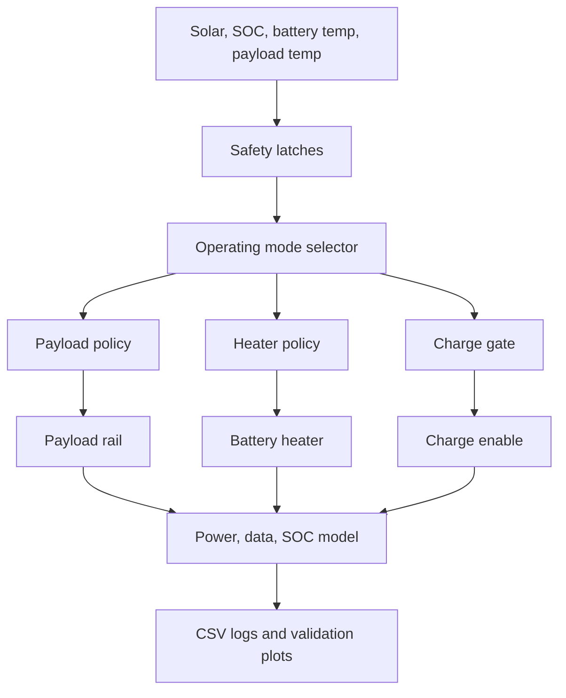

# Final Technical Documentation

## Subsystem Boundary

The project is a CubeSat albedo payload and EPS power-management subsystem. It
does not replace the full spacecraft EPS. The controller manages three outputs:

- payload rail enable
- battery heater switch
- charge enable / inhibit

## Aether-Albedo-1 Spec Sheet

| Parameter | Current value |
| --- | ---: |
| Spacecraft profile | Aether-Albedo-1 design-under-test |
| Form factor | 1U assumed |
| Battery | 14.8 Wh, Quetzal-style 1S2P Li-ion pack |
| Solar input | 2.37 W |
| Heater-off bus load | 0.66370 W |
| Payload active load | 0.123 W |
| Analytical heater power | 0.6735 W |
| Firmware conservative heater estimate | 0.898 W |
| Orbit period | 94.469 min |
| Nominal eclipse | 31.5 min |
| Realistic cold-season block | Two 45-day windows per year; each has 35 low-beta days at 36.0 min eclipse |
| Stress cold-season block | Two 45-day windows per year at 41.5 min eclipse |
| Payload hot-off threshold | 85 C |
| Payload hot-on threshold | 75 C |
| Battery heater latch on | <= -5 C |
| Battery heater latch off | >= 5 C |
| Strong heater threshold | <= -10 C |
| Critical cold threshold | <= -15 C |
| Charge-safe battery temperature | 0 C to 45 C |
| Charge stop SOC | 95% |

The higher 0.898 W value is used inside the firmware's conservative onboard
power-margin estimate. The analytical albedo design-under-test uses 0.6735 W as
the modeled heater hardware assumption.

## Power Accounting

The `0.66370 W` heater-off bus load is a lumped fixed spacecraft-bus assumption,
not a measured communication-box-only load. It is held constant for both the
protected baseline and our adaptive controller.

| Fixed-bus subpart | Current treatment |
| --- | --- |
| EPS microcontroller/sensors | Included in fixed bus; earlier public-reference estimate was about 0.022 W. |
| OBC / housekeeping electronics | Included in fixed bus. |
| Communications box standby/idle | Included in fixed bus, but not separated as its own measured value. |
| Regulator and conversion overhead | Included in fixed bus. |
| Unassigned heater-off bus remainder | About 0.6417 W after subtracting the 0.022 W EPS microcontroller/sensor estimate. |

The model uses this power equation:

```text
total consumed energy =
  fixed bus energy
  + payload energy
  + heater energy
  + peak/other event energy
```

Annual cold long-eclipse stress-year 5-year component accounting:

| Component | Protected baseline | Our controller | Difference |
| --- | ---: | ---: | ---: |
| Fixed bus | 29.090 kWh | 29.090 kWh | 0.000 kWh |
| Payload | 2.735 kWh | 3.390 kWh | 0.656 kWh higher for our controller |
| Heater | 4.362 kWh | 0.579 kWh | 3.783 kWh saved |
| Peak/other event overhead | 0.049 kWh | 0.063 kWh | 0.014 kWh higher for our controller |
| Total consumed | 36.236 kWh | 33.122 kWh | 3.114 kWh saved |

The heater reduction is large relative to heater energy:

```text
heater reduction = (4.362 - 0.579) / 4.362 = 86.73%
```

The total-energy reduction is smaller because the fixed bus is unchanged and
dominates total consumption:

```text
total reduction = (36.236 - 33.122) / 36.236 = 8.59%
```

For this reason, the project should describe the fixed load as a lumped
spacecraft-bus assumption and should not imply that the full `0.66370 W` is the
communication box alone.

## Data Flow



Inputs:

| Input | Use |
| --- | --- |
| Solar ADC / daylight | Determines sunlight, weak sunlight, strong sunlight, and generated-power estimate. |
| Battery temperature | Heater latch, strong heater, critical cold override, and charge safety. |
| Payload temperature | Payload thermal lockout. |
| SOC estimate | Payload throttling, low-SOC safe mode, heater permission, and charge stop. |
| Fault check | Sends controller to fault-safe behavior. |

Outputs:

| Output | Controlled behavior |
| --- | --- |
| Payload rail | Enables or disables albedo payload sampling. |
| Heater switch | Applies low, strong, or survival heater pulses. |
| Charge enable | Allows charging only under safe sunlight, SOC, temperature, and fault conditions. |
| Telemetry/logs | Records mode, policy, power, SOC, temperature, data, and cold-charge exposure. |

## Priority Order

| Priority | Check | Mode selected |
| ---: | --- | --- |
| 1 | Fault detected | `FAULT_SAFE` |
| 2 | Payload thermal lockout active | `THERMAL_SAFE` |
| 3 | No daylight | `ECLIPSE_SURVIVAL` |
| 4 | Low SOC lockout or SOC < 40% | `LOW_SOC_SAFE` |
| 5 | Weak sunlight and battery temperature < 5 C | `PRE_ECLIPSE_PREP` |
| 6 | SOC < 60% or power margin < 0.10 W | `SUNLIGHT_POWER_SAVE` |
| 7 | Strong sunlight, SOC >= 85%, and margin >= 0.15 W | `SUNLIGHT_SCIENCE` |
| 8 | Any other daylight condition | `SUNLIGHT_SCHEDULED` |

## Operation Mode Table

| Mode | Entry condition | Payload action | Heater action | Charge action |
| --- | --- | --- | --- | --- |
| `SUNLIGHT_SCIENCE` | Strong sunlight, SOC >= 85%, strong margin | 100% duty | Off/low/strong depending on battery temperature | Allowed only if 0 C to 45 C and SOC < 95% |
| `SUNLIGHT_SCHEDULED` | Daylight, healthy SOC, normal margin | 95% duty | Off/low/strong depending on battery temperature | Allowed only if safe |
| `SUNLIGHT_POWER_SAVE` | SOC < 60% or weak margin | 35% duty | Off/low/strong if SOC allows | Allowed only if safe |
| `PRE_ECLIPSE_PREP` | Weak sunlight and cold battery trend | 80% duty | Usually low pulse if heater latch is active | Usually inhibited if battery remains below 0 C |
| `ECLIPSE_SURVIVAL` | No daylight | Payload off | Strong pulse, or survival heat if critical cold | Off |
| `LOW_SOC_SAFE` | SOC below safe threshold | Payload off | Off unless critical cold requires survival heat | Safe only; generally inhibited by state |
| `THERMAL_SAFE` | Payload temperature >= 85 C | Payload off | Temperature-dependent | Safe only |
| `FAULT_SAFE` | Sensor/fault condition | Payload off | Low pulse only if SOC permits, survival if critical cold | Off if fault detected |

## Payload Policy

Heartbeat period: 60 s.

| Policy | Window | Duty | Trigger |
| --- | ---: | ---: | --- |
| `CONTINUOUS_SUNLIGHT` | 60 s of each 60 s heartbeat | 100% | `SUNLIGHT_SCIENCE` |
| `SCHEDULED_SUNLIGHT` | 57 s of each 60 s heartbeat | 95% | `SUNLIGHT_SCHEDULED` |
| `REDUCED_CADENCE` | 21 s of each 60 s heartbeat | 35% | `SUNLIGHT_POWER_SAVE` |
| `PRE_ECLIPSE_LOW_DUTY` | 48 s of each 60 s heartbeat | 80% | `PRE_ECLIPSE_PREP` |
| `OFF` | 0 s of each 60 s heartbeat | 0% | Eclipse, low SOC, thermal safe, or fault safe |

The 80% pre-eclipse duty is the final tuned value. It replaced the older 25%
setting because the older setting saved energy but dropped cold long-eclipse
data retention below the 95% target.

## Heater Policy

| Battery/mission condition | Heater policy | Pulse | Duty |
| --- | --- | ---: | ---: |
| Heater latch off, battery >= 5 C | `HEATER_OFF` | 0 s of each 60 s heartbeat | 0% |
| Normal cold, battery <= -5 C | `HEATER_PULSE_LOW` | 12 s of each 60 s heartbeat | 20% |
| Strong cold, battery <= -10 C | `HEATER_PULSE_STRONG` | 21 s of each 60 s heartbeat | 35% |
| Eclipse survival while cold | `HEATER_PULSE_STRONG` | 21 s of each 60 s heartbeat | 35% |
| Critical cold, battery <= -15 C | `HEATER_SURVIVAL` | 60 s of each 60 s heartbeat | 100% |

Critical cold overrides normal SOC heater limits because battery survival is
prioritized above payload collection.

## Charge Policy

Charging is enabled only when all conditions are true:

| Condition | Required value |
| --- | --- |
| Daylight | True |
| SOC | < 95% |
| Battery temperature | 0 C to 45 C |
| Fault | No fault |

The final analytical model compares this strict charge gate against a modest
Quetzal-style protected estimate that allows imperfect heater-assisted charging
down to -0.5 C.

## Baseline Labels

| Label | Meaning |
| --- | --- |
| `no_charge_temp_gate_baseline` | Harsh stress baseline used only to demonstrate why charge-temperature gating matters. |
| `quetzal_style_heater_protected_baseline` | Source-backed Quetzal-style estimate with protected 3 C / 5 C thermostat heater behavior, still not real Quetzal flight telemetry. |
| `our_adaptive_albedo` | Final tuned controller and design-under-test. |

## Main Limitation

The model is an analytical comparison, not a flight-qualified battery lifetime
model. SOC sensing is still generic, heater performance is not thermal-vacuum
validated, and the battery degradation proxy must be replaced by cell-specific
test data before flight-equivalent claims.
